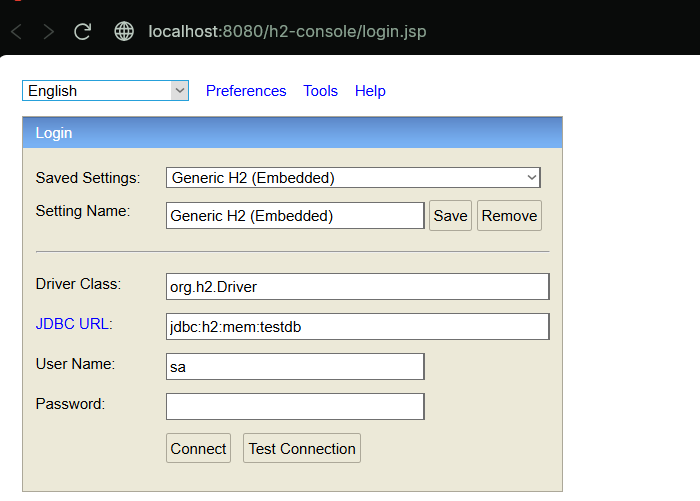

# Spring Boot - Accessing Data with JPA

Este proyecto es un ejemplo práctico de cómo usar **Spring Boot** junto con **Spring Data JPA** y **H2 Database** para crear, almacenar y consultar datos de una entidad sencilla en una base de datos relacional en memoria.

---

## Requisitos

- Java 17 o superior
- Maven 3.5+ (el wrapper `mvnw` está incluido en el proyecto)
- Un IDE o editor de texto (IntelliJ, VSCode, Spring Tools Suite, Eclipse, etc.)

---

## Pasos implementados

### 1. Configuración inicial
Se creó un proyecto con [Spring Initializr](https://start.spring.io) con las dependencias:
- **Spring Data JPA**
- **H2 Database**

### 2. Entidad `Customer`
La clase `Customer` representa una entidad con:
- `id` (clave primaria autogenerada)
- `firstName`
- `lastName`

### 3. Repositorio
Se creó una interfaz `CustomerRepository` que extiende de `CrudRepository` y provee:
- `save()`, `findAll()`, `delete()`, entre otros métodos.
- Métodos personalizados como `findByLastName(String lastName)` y `findById(long id)`.

### 4. Clase principal
La clase `AccessingDataJpaApplication` usa un `CommandLineRunner` que:
1. Inserta 5 clientes en la base de datos.
2. Muestra todos los clientes (`findAll()`).
3. Consulta un cliente por id (`findById(1L)`).
4. Consulta clientes por apellido (`findByLastName("Bauer")`).

### 5. Configuración de H2
En `application.properties` se configuró una base de datos H2 en memoria:

```
properties
spring.datasource.url=jdbc:h2:mem:testdb;DB_CLOSE_DELAY=-1;MODE=LEGACY
spring.datasource.driverClassName=org.h2.Driver
spring.datasource.username=sa
spring.datasource.password=
spring.jpa.hibernate.ddl-auto=update
spring.h2.console.enabled=true
logging.level.org.hibernate.SQL=INFO
```

## Para ejecutar el proyecto
- En nuestra consola escribimos mvn clean package.
- Luego escribimos mvn spring-boot:run y daremos enter.

- vamos a nuestro github y copiamos el link.
- En nuestra carpeta de confianza escribimos: git clone https://github.com/Ttowers-09/Jpa_AwsCli_IvanTorres_Arep.git

- Escribimos cd Jpa_AwsCli_IvanTorres_Arep para acceder a la carpeta.
- alli escribimos mvn clean package para generar el .tar
- Luego escribimos mvn spring-boot:run para la ejecución.
- Alli nos dirigimos a nuestro localhost (Especificado mas abajo).


## Para visualizar el archivo del proceso de AWS Cli
- En la carpeta Jpa_AwsCli_IvanTorres_Arep escribimos cd AWS_CLIS y allí encontraremos el formato.pdf

## Para terminar la ejecución
- Seleccionamos Ctrl + c y daremos enter.

## Estructura del proyecto:
```
C:.
├───.mvn
│ └───wrapper
├───src
│ ├───main
│ │ ├───java
│ │ │ └───com
│ │ │ └───example
│ │ │ └───accessing_data_jpa
│ │ └───resources
│ └───test
│ └───java
│ └───com
│ └───example
│ └───accessing_data_jpa
└───target
├───classes
│ └───com
│ └───example
│ └───accessing_data_jpa
├───generated-sources
│ └───annotations
├───maven-status
├───surefire-reports
└───test-classes
```
## Imagen de nuestro properties:


## Imagen de la salida:


## Como se veria si lo ejecutamos en nuestro localhost:8080

- En n uestro browser escribimos: http://localhost:8080/h2-console

- Se verá de la siguiente manera:


- Allí colocamos las credenciales:
JDBC URL: jdbc:h2:mem:testdb
User Name: sa

- Daremos al boton "Connect" y se vera de la siguiente manera:


- Alli podremos realizar la consulta:


